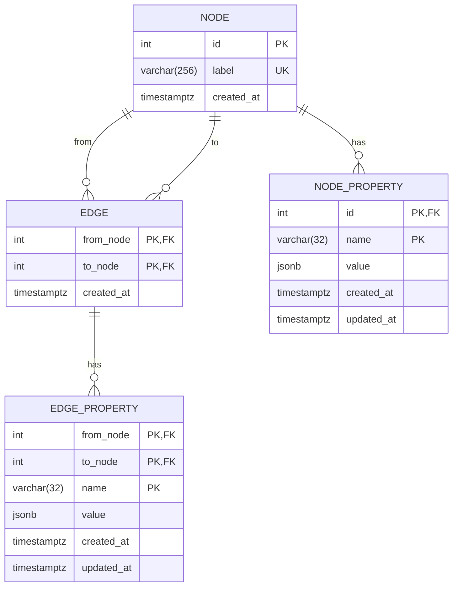

# Database schema

```mermaid
erDiagram
    NODE ||--o{ EDGE : "from"
    NODE ||--o{ EDGE : "to"
    NODE ||--o{ NODE_PROPERTY : "has"
    EDGE ||--o{ EDGE_PROPERTY : "has"
    NODE {
        int id PK
        varchar(256) label UK
        timestamptz created_at
    }
    EDGE {
        int from_node PK,FK
        int to_node PK,FK
        timestamptz created_at
    }
    NODE_PROPERTY {
        int id PK,FK
        varchar(32) name PK
        jsonb value
        timestamptz created_at
        timestamptz updated_at
    }
    EDGE_PROPERTY {
        int from_node PK,FK
        int to_node PK,FK
        varchar(32) name PK
        jsonb value
        timestamptz created_at
        timestamptz updated_at
    }
```
