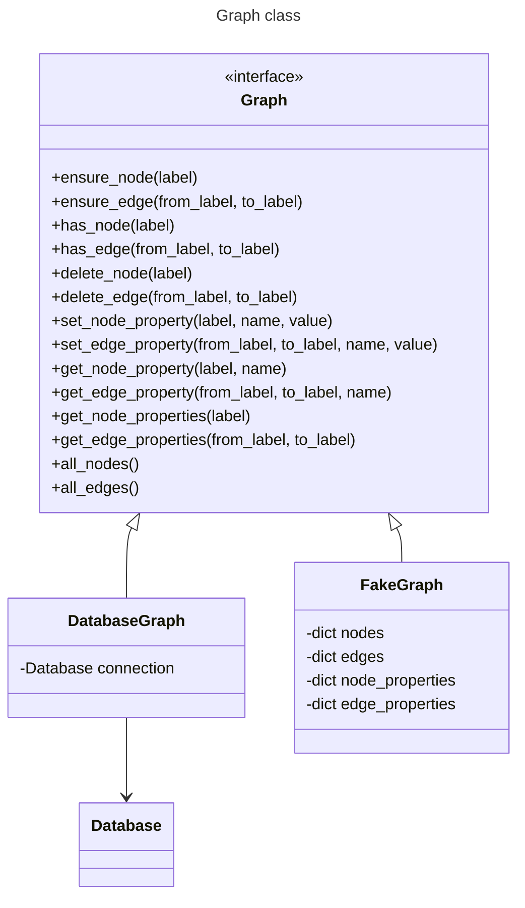

# Graph

```mermaid
---
title: Graph class
---
classDiagram
    class Database
    class Graph {
        <<interface>>
        +ensure_node(label)
        +ensure_edge(from_label, to_label)
        +has_node(label)
        +has_edge(from_label, to_label)
        +delete_node(label)
        +delete_edge(from_label, to_label)
        +set_node_property(label, name, value)
        +set_edge_property(from_label, to_label, name, value)
        +get_node_property(label, name)
        +get_edge_property(from_label, to_label, name)
        +get_node_properties(label)
        +get_edge_properties(from_label, to_label)
        +all_nodes()
        +all_edges()
    }
    class DatabaseGraph {
        -Database connection
    }
    DatabaseGraph --> Database
    class FakeGraph {
        -dict nodes
        -dict edges
        -dict node_properties
        -dict edge_properties
    }
    Graph <|-- DatabaseGraph
    Graph <|-- FakeGraph
```
